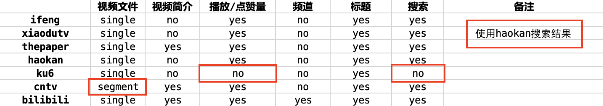
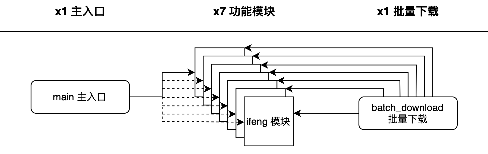
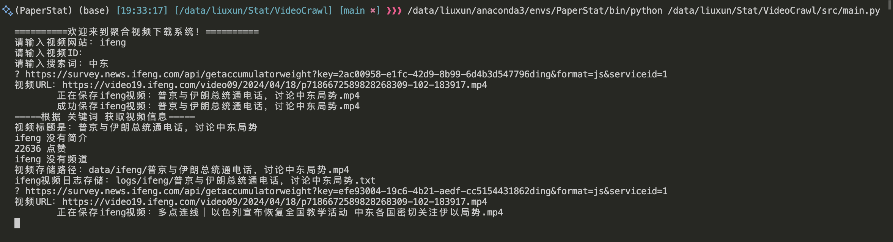

# UnifiedVideoCrawl-聚合视频下载系统

> 网络信息内容安全2024大作业一
>
> 20240424
> 
> 执笔：aq

## 支持网站

根据实验要求，本项目共支持七个视频网站

1. v.ifeng.com 凤凰网，视频在[https://v.ifeng.com](https://v.ifeng.com)
2. v.xiaodutv.com 百搜视频
3. www.thepaper.cn 澎湃网，视频在[https://www.thepaper.cn/channel_26916](https://www.thepaper.cn/channel_26916)
4. haokan.baidu.com 好看视频
5. www.ku6.com 酷6网
6. tv.cntv.cn 央视网
7. www.bilibili.com 哔哩哔哩

## 支持功能

结合实验要求，经过整理，各个网站存在的功能如下表所示：



红框圈出的内容为相较于其他网站，有较大差异的功能：

1. cntv的视频是分为多个ts文件传输，其他视频网站的视频都是单个媒体文件。
2. ku6是七个网站中唯一一个没有播放/点赞量的。
3. ku6还是七个网站中唯一一个没有搜索功能的。
4. xiaodutv的搜索结果自动跳转到百度，聚合了haokan, bilibili, weibo多家搜索结果内容。为了方便起见，同时也不影响实验效果，xiaodutv的搜索使用haokan的方法。

## 项目结构

```
VideoCrawl
├─ README.md
├─ data
│  ├─ bilibili
│  │  └─ *.mp4
│  ├─ cntv
│  │  └─ *.mp4
│  ├─ haokan
│  │  └─ *.mp4
│  ├─ ifeng
│  │  └─ *.mp4
│  ├─ ku6
│  │  └─ *.mp4
│  ├─ thepaper
│  │  └─ *.mp4
│  └─ xiaodutv
│     └─ *.mp4
├─ logs
│  ├─ bilibili
│  │  ├─ bilibili.csv
│  │  └─ *.txt
│  ├─ cntv
│  │  ├─ *.txt
│  │  └─ cntv.csv
│  ├─ haokan
│  │  ├─ haokan.csv
│  │  └─ *.txt
│  ├─ ifeng
│  │  ├─ ifeng.csv
│  │  └─ *.txt
│  ├─ ku6
│  │  ├─ ku6.csv
│  │  └─ *.txt
│  ├─ thepaper
│  │  ├─ thepaper.csv
│  │  └─ *.txt
│  └─ xiaodutv
│     ├─ xiaodutv.csv
│     └─ *.txt
├─ pics
│  ├─ example.png
│  ├─ framework.png
│  └─ func.png
├─ requirements.txt
├─ scripts
│  ├─ draft.ipynb
│  ├─ test.html
│  └─ test.py
└─ src
   ├─ basicdemo.pdf
   ├─ batch_download.py
   ├─ bilibili.py
   ├─ cntv.py
   ├─ draw.py
   ├─ haokan.py
   ├─ ifeng.py
   ├─ ku6.py
   ├─ main.py
   ├─ structure.py
   ├─ thepaper.py
   └─ xiaodutv.py
```

几个主要目录的含义为

1. `/data` 存储视频的目录。
2. `/logs` 下载视频过程中记录的日志文件。
3. `/scripts` 项目开发所用到的测试脚本。
4. `/src` 项目主要代码。

## 代码框架

本项目分为主入口与各个网站的功能模块程序。为了解决要求中提到的批量下载问题，除此外还将各功能模块整合为`batch_download`批量下载程序。

由此可以概括为**1+X+1**的设计思路：
- 1（`/main.py`）: 用户搜索时所接触的主入口。
- X（`/src/*.py`）: 不同网站实现下载功能的具体功能模块，在本实验中$X=7$。
- 1（`/src/batch_download.py`）: 为了实现本次实验要求的批量下载，而综合了所有网站功能模块的脚本。



## 运行示例

首先安装本项目所需的代码依赖库

```python
pip install -r requirements.txt
```

然后运行主入口`main.py`文件

```python
python /src/main.py
```

就可以选择目标网站，通过输入ID或关键词来下载视频啦



**提示**：如果无法正常下载视频，大概率是cookie的问题，请尝试向`/src/[对应网站].py`的headers字段添加自己在该网站的cookie。关于如何获取自己的cookie，请参考[【个人疑问】浏览器如何获取网页的COOKIE？](https://blog.csdn.net/qq_53170066/article/details/133888747)

## 致谢

感谢[@Paul Deng](https://github.com/pauldeng)修复本项目的依赖文件`requirements.txt`。Paul Deng在issues中提出的[下载CCTV央视视频的一些心得](https://github.com/AntiQuality/VideoCrawl/issues/2)，也推荐对央视视频下载感兴趣的朋友们一看！